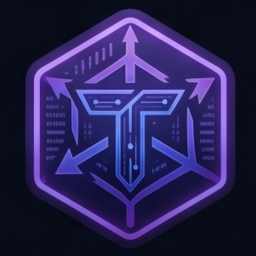

<p align="center">
  
</p>

<h1 align="center">Talon</h1>

<p align="center">
  A fast, modern web-security toolkit for solo bug bounty hunters.<br>
  Proxy, replay, match &amp; replace, scope, search, and an in-app LLM agent — in one desktop app.
</p>

<p align="center">
  <a href="https://github.com/pedro-tramontin/talon/actions/workflows/ci.yml"></a>
  <a href="https://github.com/pedro-tramontin/talon/releases"></a>
  <a href="https://github.com/pedro-tramontin/talon/blob/main/LICENSE"></a>
  <a href="https://github.com/pedro-tramontin/talon/releases"></a>
  <a href="https://github.com/pedro-tramontin/talon/commits/main"></a>
  <a href="https://github.com/pedro-tramontin/talon"></a>
</p>

## Features

- **MITM proxy** — HTTP/1.1 and HTTP/2, dynamic CA generated on first install, MITM with on-the-fly TLS termination per host, transparent upstream forwarding with connection pooling.
- **Capture UI** — virtualized exchange list (10k+ rows without breaking a sweat), FTS5-backed search with 200ms debounce, 4-tab right rail (Inspector / Decoder / Diff / Notes) per exchange.
- **Replay** — stateful tabs, full request editor (method, URL, headers, body), per-tab send history with one-click replay, built-in diff against the captured source response.
- **Match & Replace** — URL / header / body rewrites with regex or literal matching, per-rule priority, per-rule enable toggle. Operates on live traffic before it's forwarded upstream.
- **Scope** — in-scope / out-of-scope / block tagging, per-rule priority, color-coded rows in the exchange list. In-memory rules (persistence ships in a follow-up).
- **Hex viewer** — binary request/response bodies rendered in a fixed-width hex grid with a 4096-row cap.
- **Decoder** — base64 / URL / hex / smart-decode inline in the right rail, no round-trip to a separate tool.
- **Diff** — Myers algorithm (via the `diff` package) for replay-vs-source and exchange-vs-exchange comparisons.
- **SQLite project storage** — per-project `.sqlite` file in the OS user-data dir, indexed FTS5 search, tags, notes, starred-flag, and full exchange history.
- **Tags & Notes** — free-form tags, markdown-rendered per-exchange notes (64KB cap), star-toggle for important exchanges.
- **Internal LLM agent** — OpenAI-compatible client (LM Studio / Ollama / OpenAI / any `/v1/chat/completions` endpoint), Cmd-K palette, allow-list of tools per run, per-tool confirm dialogs for destructive actions, `type DELETE` double-confirm for `talon_delete_exchange`.
- **MCP server** — 20 tools over stdio, drives Talon from external LLMs (Claude Desktop, etc.) with the same engine the UI uses. Ships as `bk-mcp` crate in the workspace.
- **Supply-chain hardening** — strict CSP locked to bundled assets, `cargo-deny` blocking check, `pnpm audit` at moderate severity, threat-model ADR, threat-model binary scan guarding the build-time-only `dom_query` and `quick-xml` crates.

## Quick start

### Download

Grab a prebuilt release for your platform from the [Releases page](https://github.com/pedro-tramontin/talon/releases):

- **Linux** — `Talon_<version>_amd64.deb` (Debian/Ubuntu) or `Talon_<version>_amd64.AppImage` (portable)
- **macOS** — `Talon_<version>_universal.dmg` (Intel + Apple Silicon)
- **Windows** — `Talon_<version>_x64-setup.exe` (NSIS) or `Talon_<version>_x64_en-US.msi` (WiX)

### Build from source

See [`docs/requirements.md`](docs/requirements.md) for the full toolchain list. Short version:

```bash
# Prereqs: Rust ≥ 1.78, Node ≥ 22.13, pnpm ≥ 11, Tauri 2 system deps for your OS
git clone https://github.com/pedro-tramontin/talon
cd talon
make build-ui   # one-time: build the React UI to ui/dist/
cargo run --bin talon   # launch the desktop app
```

A `Makefile` at the repo root orchestrates the cross-language build:

```bash
make build-ui   # build the React UI (ui/dist/) — required once per fresh checkout
make ci         # the full pipeline: build-ui + fmt + clippy + test + audit
```

Individual targets:

```bash
make fmt        # cargo fmt --all -- --check
make clippy     # cargo clippy --workspace --all-targets -- -D warnings
make test       # cargo test --workspace
make audit      # pnpm audit + cargo deny check advisories
make audit-prod # pnpm audit --prod + cargo deny check advisories
make audit-binary  # release-build + scan binary for build-time-only crate symbols
make clean      # cargo clean + rm -rf ui/dist ui/node_modules
```

### Development

```bash
# One-time setup
make build-ui

# During development
cd ui && pnpm dev              # Vite dev server (HMR for the UI)
cargo run --bin talon          # in another terminal — starts the Tauri app pointed at the dev server

# Before opening a PR
make ci
```

## Architecture

Talon is a Rust workspace with a Tauri 2 desktop shell:

- **`bk-core`** — request / response / project / scope / match-replace types, error enums, Uuid wrappers
- **`bk-store`** — SQLite persistence (migrations, FTS5 search, tag CRUD, per-project `.sqlite` files)
- **`bk-events`** — typed `WireEvent` envelope + `fan_in` helper for cross-source event aggregation
- **`bk-engine`** — long-lived `Engine` that holds open projects, serves Tauri commands, and bridges the proxy → store
- **`bk-proxy`** — MITM proxy (HTTP/1.1 + HTTP/2, dynamic CA, body streaming, upstream pool with ALPN)
- **`bk-mcp`** — stdio MCP server (20 tools, drives Talon from external LLMs)
- **`bk-agent`** — OpenAI-compatible agent loop, per-tool confirm dialogs
- **`app`** — Tauri 2 shell: 21 Tauri commands, React frontend, wire-bus event fan-in
- **`ui`** — React 18 + TypeScript + Vite + Tailwind + Zustand

See [`docs/adr/0001-supply-chain-monitoring.md`](docs/adr/0001-supply-chain-monitoring.md) for the supply-chain threat model and the rationale for the build-time-only crate isolation.

## Security

**Threat-model controls** (in `app/tauri.conf.json`):

- A strict CSP that locks the webview to bundled assets only (`default-src 'self'`, plus explicit `base-uri 'none'`, `form-action 'none'`, `object-src 'none'`, `frame-ancestors 'none'`).
- The webview is created with `WebviewUrl::App(...)` (the Tauri 2 default for `tauri.conf.json`'s `build.frontendDist`), which means the only valid URL is the local file path to `index.html` in the bundled dist. No remote URL loading is possible without a code change.

**Supply-chain enforcement** (every PR, blocking):

- `pnpm audit --audit-level=moderate` — fails on any JS advisory at moderate severity or above.
- `cargo deny check advisories` — fails on any Rust advisory (with 18 known upstream-blocked ones in `deny.toml`'s `ignore` list).
- `make audit-binary` (CI only) — builds the release binary unstripped and scans the symbol table to confirm `dom_query` and `quick-xml` (the two build-time-only DoS-reachable crates) have not leaked into the runtime binary.
- Renovate opens weekly PRs for new npm, cargo, and GitHub Actions versions (see `renovate.json5`).
- A quarterly cron checks the Tauri and `urlpattern` release pages; when a release mentions GTK4 or `unic-*` migration, the maintainer is alerted that the relevant `deny.toml` ignores can be removed.

**Adding a new dependency?**

- For npm: add it to `ui/package.json`, run `pnpm install`, then `make audit`. CI will run the audit on your PR.
- For cargo: add it to the relevant `Cargo.toml`, then `make audit`. CI will run the audit on your PR.

**If CI fails on an advisory you didn't introduce:**

- Check if it's a new one (you can fix it by bumping the affected dep).
- If it's an upstream-blocked one (matches an ID in `deny.toml`), follow the ADR's re-evaluation rules before adding a new `ignore` entry.

## License

[Apache-2.0](LICENSE).
