# Architecture

Talon is a Rust workspace that powers a Tauri 2 desktop application. The Rust core does all the heavy lifting (proxy, storage, search, MCP, agent), the Tauri shell is a thin IPC bridge, and the React UI is a stateful client over that IPC bridge.

This document is the canonical design overview. For the rationale behind specific decisions, see the [ADRs](adr/) (start with [0001 — supply-chain monitoring](adr/0001-supply-chain-monitoring.md)). For the release process, see [`release-process.md`](release-process.md).

## Crate layout

| Crate | Purpose |
|---|---|
| `bk-core` | Request / response / project / scope / match-replace / tag / filter types. Error enums, `Uuid` wrappers, `#[non_exhaustive]` markers for Phase 10 v2 extension points. No I/O. |
| `bk-store` | SQLite persistence. Migrations, FTS5 search, tag CRUD, per-project `.sqlite` files in the OS user-data dir. |
| `bk-events` | Typed `WireEvent` envelope + `fan_in` helper for cross-source event aggregation. The single source of truth for "an event happened in the system." |
| `bk-engine` | Long-lived `Engine` that holds the pool of open projects, serves the Tauri command surface, and bridges `bk-proxy` → `bk-store`. Wraps the events bus. |
| `bk-proxy` | MITM proxy. HTTP/1.1 + HTTP/2, dynamic CA generated on first install, CONNECT intercept, per-host TLS termination, transparent upstream forwarding, body streaming, ALPN-aware upstream pool. Also hosts the scope and match-replace engines. |
| `bk-mcp` | stdio MCP server (20 tools). Drives Talon from external LLMs (Claude Desktop, etc.) over the same engine the UI uses. |
| `bk-agent` | OpenAI-compatible agent loop. Connects to LM Studio / Ollama / OpenAI / any `/v1/chat/completions` endpoint. Per-tool confirm dialogs in the UI. |
| `app` | Tauri 2 shell. 21 Tauri commands, the `WireClient` (Tauri event bus consumer), and the React-frontend mount point. |
| `ui` | React 18 + TypeScript + Vite + Tailwind + Zustand. The only user-facing surface. |

## Layered architecture

Talon follows a strict layered model. The UI knows about Tauri commands; the Tauri shell knows about the engine; the engine knows about the domain types and the persistence layer. Nothing skips a layer, and no layer reaches sideways (with one exception: the `bk-events` events bus crosses every layer as a horizontal conduit).

```mermaid
%%{init: {'flowchart': {'htmlLabels': true, 'curve': 'linear'}}}%%
flowchart TB
    subgraph L1["Layer 1 — UI (React)"]
        direction LR
        L1a["ExchangeList"] ~~~ L1b["ReplayView"] ~~~ L1c["SettingsModal"]
        L1d["AgentPanel"] ~~~ L1e["RightRail"] ~~~ L1f["NotesPanel"]
    end

    subgraph L2["Layer 2 — UI state (Zustand stores)"]
        direction LR
        L2a["projectStore"] ~~~ L2b["exchangeStore"] ~~~ L2c["replayStore"]
        L2d["scopeStore"] ~~~ L2e["agentStore"] ~~~ L2f["wsStore"]
    end

    subgraph L3["Layer 3 — IPC bridge"]
        direction TB
        L3a["ui/src/api.ts<br/>invoke('open_project', ...)"]
        L3b["app::lib.rs<br/>invoke_handler! (Tauri shell)"]
    end

    subgraph L4["Layer 4 — Tauri command surface (21 commands)"]
        direction LR
        L4a["open_project<br/>list_exchanges<br/>get_exchange<br/>start_proxy"]
        L4b["send_replay<br/>open_replay_tab<br/>search_exchanges"]
        L4c["list_scope_rules<br/>add_match_replace_rule<br/>update_notes"]
        L4d["agent_start<br/>agent_confirm_write<br/>agent_cancel"]
    end

    subgraph L5["Layer 5 — Application core (bk-engine)"]
        direction TB
        L5a["struct Engine {<br/>  config_dir: PathBuf<br/>  projects: Projects<br/>  event_tx: EventSender<br/>  mcp_event_tx: McpEventSender<br/>}"]
        L5b["impl Engine {<br/>  fn open_project, close_project<br/>  fn get_exchange, list_recent<br/>  fn subscribe_events, subscribe_mcp_events<br/>}"]
    end

    subgraph L6["Layer 6 — Domain engines"]
        direction LR
        L6a["bk-proxy<br/>mitm.rs<br/>upstream_pool.rs<br/>listener.rs"]
        L6b["Scope::evaluate<br/>MatchReplace::apply<br/>(bk-proxy::scope, match_replace)"]
        L6c["bk-agent<br/>AgentLoop<br/>PromptBuilder<br/>ToolRegistry"]
    end

    subgraph L7["Layer 7 — Domain types (bk-core)"]
        direction LR
        L7a["HttpExchange<br/>Request, Response<br/>Body (Complete, Streaming)"]
        L7b["Project, ProjectSettings<br/>ScopeRule, MatchReplaceRule<br/>Tag, Note, ExchangeMeta"]
    end

    subgraph L8["Layer 8 — Persistence (bk-store)"]
        direction LR
        L8a["Projects (pool)<br/>Exchanges CRUD<br/>FTS5 index<br/>Tags CRUD"]
        L8b[("SQLite<br/>per-project<br/>.sqlite files")]
    end

    %% Side-cars
    subgraph SIDE_MCP["Side-car — bk-mcp (parallel IPC)"]
        direction TB
        SIDE_MCP_a["stdio JSON-RPC server<br/>20 tools over rmcp<br/>McpError -> JSON-RPC codes"]
    end

    subgraph SIDE_BUS["Cross-cutting — bk-events (the events bus)"]
        direction LR
        SIDE_BUS_a["WireEvent {<br/>  seq: u64<br/>  kind: WireEventKind<br/>}"]
        SIDE_BUS_b["WireEventKind:<br/>ExchangeInserted | RequestCaptured<br/>ResponseCaptured | Replay | AgentMessage | ..."]
    end

    %% Vertical flow (data + control)
    L1  -->|"user input"| L2
    L2  -->|"invoke()"| L3
    L3  -->|"tauri transport"| L4
    L4  -->|"State&lt;EngineArc&gt;"| L5
    L5  -->|"engine methods"| L6
    L6  -->|"uses"| L7
    L7  -->|"SQL on"| L8

    %% Side-car connections
    SIDE_MCP -.->|"stdin/stdout<br/>(parallel IPC)"| L5
    SIDE_BUS -.->|"emits + subscribes<br/>(every layer)"| L5

    %% Bus crosses every layer
    L1 -.-> SIDE_BUS
    L4 -.-> SIDE_BUS
    L6 -.-> SIDE_BUS

    classDef sidecar fill:#1a1a2e,stroke:#8a2be2,color:#e0e0e0
    class SIDE_MCP,SIDE_BUS sidecar
```



**Reading the diagram:**

- **Top-down arrows** are the normal data + control flow. A user clicks `ExchangeList` (L1), the click hits `exchangeStore` (L2), which calls `invoke('list_exchanges', ...)` (L3) over the Tauri transport (L3 → L4), which lands in the `list_exchanges` Tauri command (L4), which calls `Engine::list_recent` (L5), which reads from `bk-store` (L5 → L7 → L8).
- **`bk-events` is the events bus.** It crosses every layer as a horizontal conduit. The proxy emits `RequestCaptured` from L6, the engine re-emits it on the Tauri bus from L5, the UI's `WireClient` subscribes in L3, and `exchangeStore` updates in L2. The seq counter is the contract: gaps in the seq are observable as a "missed events" banner in the UI.
- **`bk-mcp` is a parallel IPC bridge.** External LLMs (Claude Desktop, etc.) connect over stdio, and the MCP server translates their tool calls into the same `Engine` API that the Tauri commands use. The MCP server is NOT a layer — it's a second front door.
- **`bk-core` is the contract.** Every crate imports types from `bk-core`. The `#[non_exhaustive]` markers on `WireEvent`, `Body`, and the project types are the seam where Phase 10's plugin system will plug in.

## Process topology

One process, one Tokio runtime, one Tauri window:

```
                        ┌────────────────────────────┐
                        │  Tauri shell (app crate)   │
                        │                            │
   Browser / OS ───▶    │  ┌──────────────────────┐  │      ┌─────────────┐
   traffic (via CA)     │  │  bk-engine::Engine   │  │ ───▶ │  bk-store   │
                        │  │  (long-lived)        │  │      │  (SQLite)   │
                        │  └──────────────────────┘  │      └─────────────┘
                        │   ▲              ▲         │
                        │   │              │         │
                        │   │ events       │ proxy   │
                        │   │              │ cmds    │
                        │ ┌─┴────────┐ ┌───┴──────┐  │
                        │ │ WireClient│ │ProxyHandle│  │      ┌─────────────┐
                        │ │  (Tauri   │ │ (MITM     │  │ ───▶ │  bk-proxy   │
                        │ │  event    │ │  task)    │  │      │  (MITM)     │
                        │ │  bus)     │ │           │  │      └─────────────┘
                        │ └──────────┘ └───────────┘  │
                        │                            │      ┌─────────────┐
                        │  ┌──────────────────────┐  │ ───▶ │  bk-mcp     │
                        │  │  bk-agent            │  │      │  (stdio)    │
                        │  │  (OpenAI-compatible  │  │      └─────────────┘
                        │  │   agent loop)        │  │
                        │  └──────────────────────┘  │
                        └────────────┬───────────────┘
                                     │ IPC bridge
                                     ▼
                        ┌────────────────────────────┐
                        │  React UI (ui crate)       │
                        │  Zustand stores per        │
                        │  concern (project,         │
                        │  exchange, proxy, agent,   │
                        │  replay, scope, M&R)       │
                        └────────────────────────────┘
```

The single Tauri `App` instance owns:

- one `Arc<Engine>` (the long-lived engine),
- one `Arc<ProxyHandle>` (the MITM task + its shutdown signal),
- one `WireClient` (Tauri event bus consumer; also a singleton across the UI's component tree).

All Tauri commands are pure functions over these three handles. The Tauri shell is intentionally thin — the `app` crate is mostly IPC plumbing, the Tauri command surface (21 commands), and the React mount point.

## Data flow

### Capture path

1. The browser sends a request to `https://example.com/...`. Talon's CA is in the browser's trust store, so the OS trusts the certificate Talon generates for `example.com`.
2. Talon's listener accepts the CONNECT, terminates TLS with the per-host cert it just generated, and forwards the plaintext to the proxy task.
3. `bk_proxy::mitm` reads the request, runs it through the scope engine (`bk_proxy::scope::Scope::evaluate`), runs it through the match-replace engine (`bk_proxy::match_replace::MatchReplace::apply`), and forwards to the upstream via the ALPN-aware pool.
4. When the response comes back, `bk-proxy` builds an `HttpExchange` and emits a `RequestCaptured` / `ResponseCaptured` event on the events bus.
5. `bk-engine` subscribes to the bus, persists the exchange to the project's `.sqlite` file via `bk-store`, and re-emits the event on the Tauri bus.
6. The UI's `WireClient` receives the event, increments its monotonic seq counter, and dispatches to the appropriate Zustand store. The exchange list, the right-rail preview, and the tag/notes UI all react.

### Replay path

1. The user opens a Replay tab from a row in the exchange list. The UI calls `open_replay_tab(exchange_id)`, which clones the request into a `ReplayTabDescriptor` (the `body_truncated: bool` flag is set if the captured response was over the 1 MB cap).
2. The user edits the request in `ReplayRequestEditor` and clicks Send. The UI calls `send_replay(exchange_id, request, tab_id)`.
3. `bk-proxy`'s `upstream_pool` sends the request and collects the response. The response is shipped back over IPC (truncated if over 1 MB) and the UI stores it in the per-tab history.
4. The UI shows the response in `ReplayResponseViewer` and offers a one-click diff against the captured source response.

### Agent path

1. The user opens the Cmd-K palette (Cmd/Ctrl-K), types a query, hits Enter.
2. The UI calls `agent_start(query, allowed_tools)`. `bk-agent` opens an OpenAI-compatible chat loop, calls tools via the same `bk-engine` API the Tauri commands use.
3. Each tool call goes through the `WRITE_TOOLS` allowlist. Destructive tools (`talon_delete_exchange`, `talon_upsert_tag` mutations) pause the agent loop and show a `ConfirmDialog` in the UI; the user has 5 minutes to confirm before the agent auto-denies.
4. For `talon_delete_exchange` specifically, the user must type `DELETE` to confirm (the `type DELETE` double-confirm from §3.5d).

## Invariants

These are the load-bearing invariants the code relies on. They aren't enforced by the type system in every place (a few are still hand-checked); they are pinned by tests and by the code review checklist.

- **One Engine per process.** `app::lib` constructs a single `Engine` at startup and stores it in `tauri::State<EngineArc>`. Every Tauri command that touches the engine takes `State<'_, EngineArc>`.
- **One ProxyHandle per process.** Same pattern: `app::proxy_handle` holds the long-lived MITM task + a `tokio::sync::oneshot::Sender` for shutdown. `start_proxy` and `stop_proxy` operate on this single handle.
- **One WireClient per UI tree.** `ui/src/lib/ws.ts` exposes `getWireClient()`, a module-singleton. HMR doesn't double-listen because the client dedupes by transport.
- **Events have a monotonic seq.** Every `WireEvent` carries a `u64` sequence number assigned by the `bk-events` `fan_in` aggregator. The UI tracks `last_seen_seq` and surfaces a "missed events" banner when a gap is observed.
- **`bk-core` is the only place types are defined.** Every other crate imports from `bk-core`. The `#[non_exhaustive]` markers on `WireEvent`, `Body`, and the project types are the seam where Phase 10's plugin system will plug in (see the [Phase 10 design contract ADR](adr/) when it lands).
- **Body bytes never cross the FFI boundary directly.** `bk-core::Body` has `Complete { data: Vec<u8> }` and `Streaming { ... }` variants; the IPC DTOs use `data: String` (base64) or a `body_truncated: bool` flag with a separate on-demand fetch. This keeps the JSON IPC payload small for the 1000+ row exchange list.

## Threading and async

- The `bk-proxy` MITM task is a single `tokio::spawn` per running proxy. It owns its own connection accept loop, per-host TLS termination, and upstream forwarding.
- `bk-engine` is internally synchronized (`tokio::sync::RwLock` over the projects map, `tokio::sync::broadcast` for the events bus). Multiple Tauri commands can hold the read lock concurrently.
- The UI's Zustand stores are synchronous; the IPC bridge is async (`tauri::invoke` returns a `Promise`). The bridge layer (in `ui/src/api.ts`) wraps each invoke in a typed function.
- The wire event bus is `tokio::sync::broadcast` on the Rust side. The Tauri event bus is its own thing (a different transport). `bk-events` `fan_in` is the single point where these two worlds meet.

## Error handling

- `bk-core::Error` and `bk-core::EngineError` are the canonical error enums. Every Tauri command's `Result<T, String>` conversion goes through `Display` — the UI gets a human-readable error string, not a debug dump.
- `bk-mcp::McpError` maps to MCP JSON-RPC error codes per the MCP spec (`-32602` for invalid args, `-32603` for internal).
- The `bk-store` migrations are versioned; the schema version is stored as `PRAGMA user_version` and the engine refuses to open a project with a newer schema.

## Where to look next

- **Adding a Tauri command?** Start at `app/src/commands/core.rs` (the template) and register in `app/src/lib.rs`'s `invoke_handler!`.
- **Adding a new domain type?** Define it in `bk-core` with `#[non_exhaustive]`. Every other crate re-exports it.
- **Adding a new Tauri command that touches the events bus?** Use the `bk-events` `WireEvent` enum, not a new event channel. The bus is the contract.
- **Adding a new UI store?** Match the existing pattern in `ui/src/state/` — one store per concern, one Zustand action per UI verb, all updates go through the store (no direct `setState` outside the store).
- **Touching the proxy hot path?** The ALPN-aware pool and the upstream forwarding are in `bk-proxy/src/upstream.rs` and `bk-proxy/src/upstream_pool.rs`. The hot path is allocation-sensitive; prefer `Bytes` over `String`, prefer `&[u8]` over `Vec<u8>`.
- **Touching the supply-chain policy?** The ADRs and `deny.toml` are the contract. New ignores go through the ADR's re-evaluation rules.
